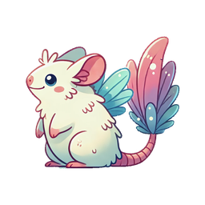

# threestudio-dreambeast
Runjia Li<sup>1</sup>, Junlin Han<sup>1</sup>, Luke Melas-Kyriazi<sup>1</sup>, Chunyi Sun<sup>2</sup>, Zhaochong An<sup>3</sup>, Zhongrui Gui<sup>1</sup>, Shuyang Sun<sup>1</sup>, Philip Torr<sup>1</sup>, Tomas Jakab<sup>1</sup>

<sup>1</sup>University of Oxford, <sup>2</sup>Australian National University, <sup>3</sup>University of Copenhagen

<a href='https://dreambeast3d.github.io/'></a>  <a href='https://arxiv.org/abs/xxx'></a>


<center><center>

## TL;DR

- We introduce **DreamBeast**, a new method for generating part-aware 3D assets **efficiently**.
- Utilize a novel **part-aware knowledge transfer** mechanism.
- Efficiently extract part-level knowledge from **Stable Diffusion 3** into a **Part-Affinity NeRF** for instant generation from various camera views.
- Render Part-Affinity maps from the **Part-Affinity NeRF** and **modulate** a multi-view diffusion model during score distillation sampling (SDS).
- Improves the part-awareness and quality of generated 3D creatures with efficient computational costs.


The DreamBeast extension for <a href='https://github.com/threestudio-project/threestudio'>threestudio</a>. To use it, simply install this extension in threestudio `custom` directory.


# Installation
```bash
cd custom
git clone https://github.com/runjiali-rl/threestudio-dreambeast.git
cd threestudio-dreambeast

# First install xformers (https://github.com/facebookresearch/xformers#installing-xformers)
# cuda 11.8 version
pip3 install -U xformers --index-url https://download.pytorch.org/whl/cu118
# cuda 12.1 version
pip3 install -U xformers --index-url https://download.pytorch.org/whl/cu121

# Then install other dependencies
pip install -r requirements.txt
```

# Quick Start
```bash
# Run the following commands in the threestudio repository

# Replace the OPENAI_API_KEY with your openai api key
python launch.py --config custom/threestudio-dreambeast/configs/dreambeast.yaml --train --gpu 0 system.prompt_processor.prompt="a creature with a body of a kangaroo and the shell of a tortoise" "system.api_key=OPENAI_API_KEY",

python launch.py --config custom/threestudio-dreambeast/configs/dreambeast.yaml --train --gpu 0 system.prompt_processor.prompt="a car with airplane wings" "system.api_key=OPENAI_API_KEY",

python launch.py --config custom/threestudio-dreambeast/configs/dreambeast.yaml --train --gpu 0 system.prompt_processor.prompt="An object with the screen of a television and the wings of a butterfly" "system.api_key=OPENAI_API_KEY",
```

# Citing

If you find DreamBeast helpful, please consider citing:

```
@article{li2024DreamBeast,
  author = {Runjia Li, Junlin Han, Luke Melas-Kyriazi, Chunyi Sun, Zhaochong An, Zhongrui Gui, Shuyang Sun, Philip Torr, Tomas Jakab},
  title = {DreamBeast: Distilling 3D Fantastical Animals with Part-Aware Knowledge Transfer},
  journal = {arXiv:2308.16512},
  year = {2023},
}
```
